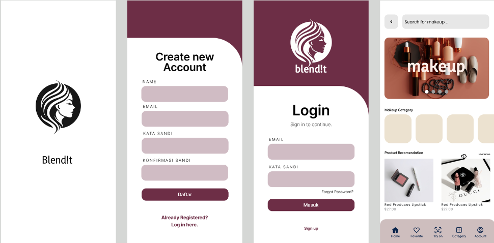
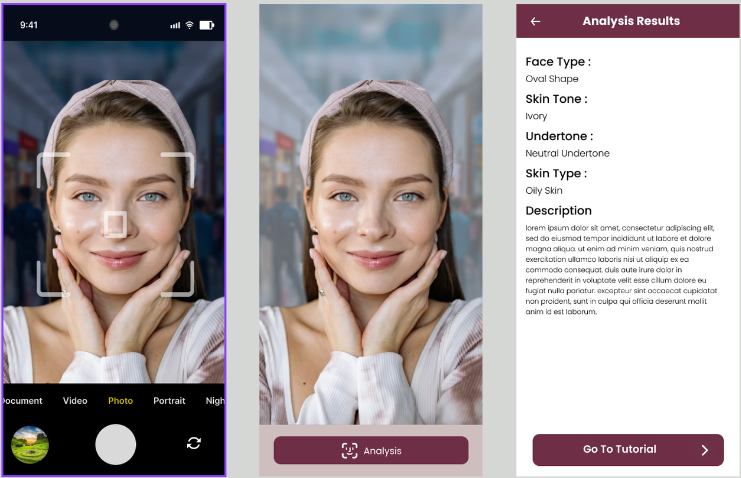
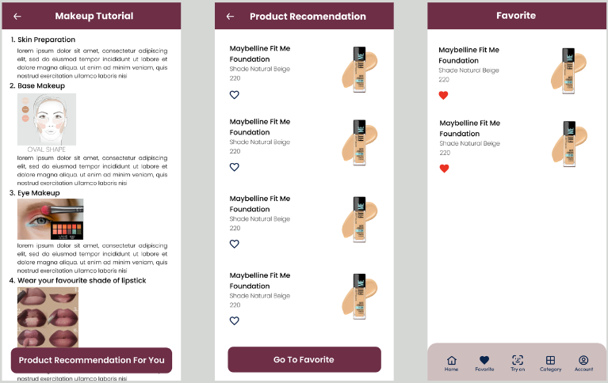
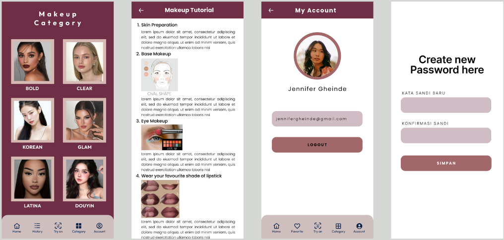
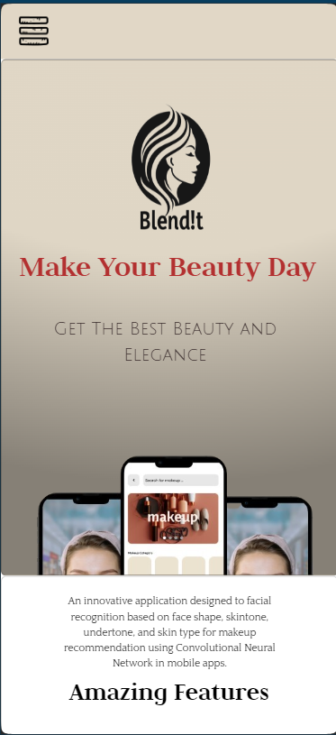
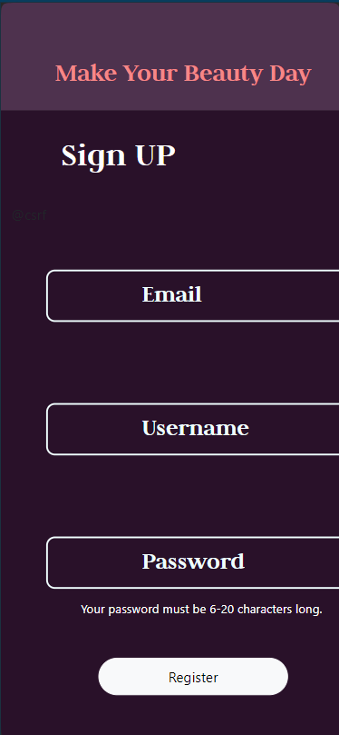

# BlendIt

## Table of Contents
- [Introduction](#introduction)
- [Features](#features)
- [Project Structure](#project-structure)
- [Design UI](#design-ui)
- [Usage](#usage)
- [Landing Page](#landing-page)
- [Contact](#contact)
- [Download APK](#download-apk)

## Introduction
**BlendIt** is an innovative facial shape detection application that provides personalized makeup tutorials and product recommendations. The application utilizes advanced machine learning algorithms to analyze facial features and suggest the best makeup techniques and products.

## Features
- **Facial Shape Detection**: Analyze facial features to determine the shape.
- **Makeup Tutorials**: Get personalized makeup tutorials based on your facial shape.
- **Product Recommendations**: Receive recommendations for makeup products tailored to your features.
- **Real-Time Processing**: Fast and accurate real-time analysis.
- **User-Friendly Interface**: Intuitive UI for seamless user experience.

## Project Structure
This repository is divided into three main sections:

1. **Backend**: Contains the API services.
    - The backend includes all the necessary files and configurations to run the server-side of the application. It handles requests from the mobile app, processes data, and communicates with the machine learning models. The backend is built using `Express.js` and includes a comprehensive set of APIs for facial shape detection, user management, and recommendation services.

2. **Mobile Development**: Contains the mobile application code built with Kotlin.
    - The mobile development directory houses the source code for the Android application. This section includes all the necessary components to create a fully functional mobile app using Kotlin. The app provides an intuitive interface for users to interact with the facial shape detection and recommendation services. Key components include activities, fragments, view models, and other resources needed for a seamless mobile experience.

3. **Machine Learning**: Contains the machine learning models and scripts for facial shape detection.
    - The machine learning directory is the core of the facial shape detection functionality. It contains pre-trained models, scripts for data preprocessing, training, and evaluation. This part of the project leverages libraries like TensorFlow to build and deploy models that analyze facial features and predict the facial shape. Key components include the `models` directory for storing model files and `scripts` for various machine learning tasks. Proper setup and configuration instructions are provided to ensure seamless integration with the backend.

## Design UI

## Usage
Once all parts are set up, you can use BlendIt by following these steps:

1. Open the Application:

    Run the mobile application and navigate to the home page.

2. Upload Image:

    Upload a clear image of your face through the app.

3. Get Analysis:

    The application will analyze your facial shape and provide personalized makeup tutorials and product recommendations.

4. Follow Recommendations:

    Follow the tutorials and use the recommended products to enhance your makeup routine.

## Landing Page

Visit our landing page to download the BlendIt application and register for an account. The landing page provides detailed information about the features of BlendIt, and a simple registration process to get started with our service.

[Our Website](https://generated-armor-424304-c8.et.r.appspot.com)

## Contact
If you have any questions or suggestions, feel free to reach out to us:

GitHub Issues: https://github.com/Danar1111/Blendit/issues

We appreciate your feedback!

## Download apk
You can download the latest version of the BlendIt APK from the link below:

- [Download Latest](blendit.apk)

 
 

> # *BlendIt - Blending Data for a Brighter Future*